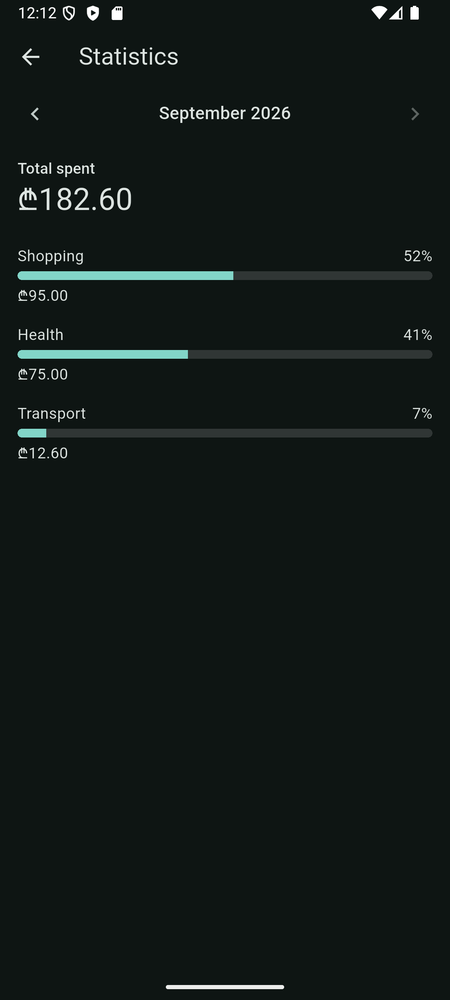
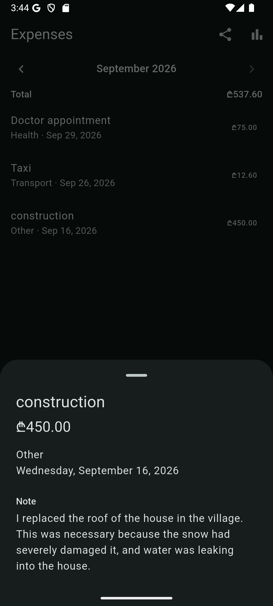
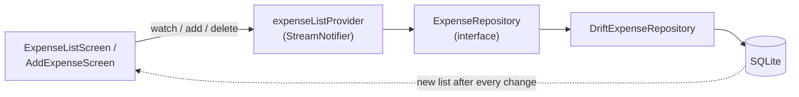

# Expense Tracker

[](https://github.com/LukaMeletidi/expense-tracker-flutter/actions/workflows/ci.yml)

An offline-first expense tracker for Android and iOS, built with Flutter,
Riverpod and Drift. Every expense is stored on the device, so the app works
without an internet connection.

<p>
  
  
  
</p>

The expense list and an empty month in the dark theme, next to the add form in
the light theme: the app follows the phone's setting.

## Features

- Add an expense with a title, amount, category, date and an optional note
- Browse expenses one month at a time, newest day first, with the month's
  total above the list
- Statistics for each month: the total spent, and each category's share
  shown as a percentage and a bar
- Tap an expense to see all its details, including the full note
  (read-only; the note can be selected and copied)
- Export the selected month as a CSV file through the phone's share sheet
  (save it to Files or Drive, email it, open it in a spreadsheet app)
- Swipe an expense away to delete it
- Data is saved in a local SQLite database and survives app restarts
- Form validation (required title, amount must be a valid number above 0)
- Every screen handles its loading, error and empty states
- Light and dark themes that follow the phone's setting

The Statistics screen, opened from the chart icon on the list, and an
expense's details, opened by tapping its row:

<p>
  
  
</p>

## Tech stack

| Package | Used for |
|---|---|
| [Flutter](https://flutter.dev) | UI for Android and iOS from one codebase |
| [Riverpod](https://riverpod.dev) | State management; keeps logic out of widgets and makes it easy to swap dependencies in tests |
| [go_router](https://pub.dev/packages/go_router) | Navigation by path (`/`, `/add`, `/stats`) instead of pushing widgets by hand |
| [Drift](https://drift.simonbinder.eu) | Type-safe SQLite; queries return a `Stream` that emits again whenever the table changes |
| [share_plus](https://pub.dev/packages/share_plus) | Opens the phone's share sheet for the CSV export; needs no storage permission |

## Architecture

The code is organised by feature, and each feature is split into three layers:

```
lib/
├── core/                       shared by the whole app
│   ├── clock/                  clockProvider ("now", replaceable in tests)
│   ├── database/               AppDatabase and its provider
│   ├── formatting/             formatCents / parseCents
│   ├── router/                 go_router setup
│   ├── sharing/                FileSharer: the share sheet, replaceable
│   │                           in tests
│   └── theme/                  light and dark themes
└── features/expenses/
    ├── domain/                 Expense, CalendarMonth, MonthSummary,
    │                           ExpenseRepository interface, dateOnly
    │                           (pure Dart: no Flutter, no Drift)
    ├── data/                   Drift table, DriftExpenseRepository
    └── presentation/           screens, providers, shared widgets
                                (month bar, details sheet), form rules,
                                CSV format
```

How data flows when the list is shown, and after an expense is added:



### Key decisions

- **Money is stored as whole cents (`int`).** `double` cannot represent money
  exactly (`0.1 + 0.2 != 0.3`), so totals would drift. `450` means 4.50.
- **The expense date is stored as text, like `'2026-09-01'`.** It is a
  calendar day, not a moment in time. A timestamp could move to a different
  day when the user changes time zone; the text means the same day everywhere,
  and it still sorts correctly. It also makes a month a simple text range
  (`'2026-09-01'` up to, but not including, `'2026-10-01'`).
- **Categories are stored by name (`'food'`), not by position.** Reordering
  the enum can then never silently change existing rows.
- **The repository is typed as an interface.** Nothing outside the data layer
  knows Drift is behind it, and tests can replace it with a fake.
- **Adding or deleting does not update the list by hand.** Drift's query
  stream sends the new list after every change, so the database is the single
  source of truth.
- **Statistics are calculated from the month's list, not queried again.**
  The totals come from the same expenses the list shows, so they always
  match the rows on screen and update on every add or delete.
- **The CSV export is made for spreadsheets.** Dates are `2026-09-29`,
  amounts are plain numbers (in GEL, stated in the header), and fields with
  commas, quotes or line breaks are quoted. Text starting with `=`, `+`, `-`
  or `@` gets a leading `'`, so a spreadsheet shows it instead of running it
  as a formula ("CSV injection"). The file is UTF-8 with a byte order mark,
  so Excel shows Georgian text and ₾ correctly.
- **Temporary form state stays in the widget; rules do not.** What the user
  is typing lives in the screen's `State`, while validation and parsing are
  plain functions with their own unit tests.

## Testing

192 tests, grouped by layer:

| Layer | Tests | How |
|---|---|---|
| Domain and formatting | 70 | Plain unit tests (entity equality, `copyWith`, `dateOnly`, `CalendarMonth`, month summaries, money parsing and formatting) |
| Data | 17 | The real Drift repository against an in-memory SQLite database |
| Providers | 21 | A Riverpod `ProviderContainer` with the in-memory database for the expense list and the month summary; the exporter with a fake repository and a fake sharer |
| Form rules, labels, percentages, CSV format and theme | 41 | Plain unit tests |
| Widgets | 43 | Screens, month navigation, statistics, the total line, the details sheet, the export button, and light/dark theme, with a fake repository |

Widget tests use a fake repository rather than SQLite: they run on a fake
clock, where Drift's stream timers can cause "Timer still pending" failures.
The fake also lets each test put the screen into a chosen state (loading,
error, empty or data). Sharing goes to a fake too, because the share_plus
plugin cannot run inside `flutter test`.

Code reads the current time through `clockProvider` instead of calling
`DateTime.now()`, and tests pin it to a fixed date, so no test depends on
today's real date.

## Getting started

Requirements: Flutter 3.44 or newer (Dart 3.12), and an Android emulator or
iOS simulator.

```sh
git clone https://github.com/LukaMeletidi/expense-tracker-flutter.git
cd expense-tracker-flutter
flutter pub get
flutter run
```

Run the checks:

```sh
flutter analyze
flutter test
```

GitHub Actions runs the same checks, plus a formatting check, on every push
to `main` and every pull request (see `.github/workflows/ci.yml`).

The Drift code generated from the table definitions
(`lib/core/database/app_database.g.dart`) is committed, so the app runs
straight after cloning. After changing a table, regenerate it with:

```sh
dart run build_runner build
```

## Future ideas

- **Editing an existing expense.** Changing or clearing any of its fields
  (title, amount, category, date or note) was intentionally left out of this
  version: an expense can be added, viewed in full and deleted as a whole,
  but not changed after saving.

## How it was built

Built with AI-assisted pair programming (Claude Code; the project rules are in
[`CLAUDE.md`](CLAUDE.md)). Every change was planned first, reviewed, and
covered by tests before it was committed.

## Author

Luka Meletidi

- GitHub: [LukaMeletidi](https://github.com/LukaMeletidi)
- LinkedIn: [Luka Meletidi](https://www.linkedin.com/in/luka-meletidi-562010349/)

## License

[MIT](LICENSE)
